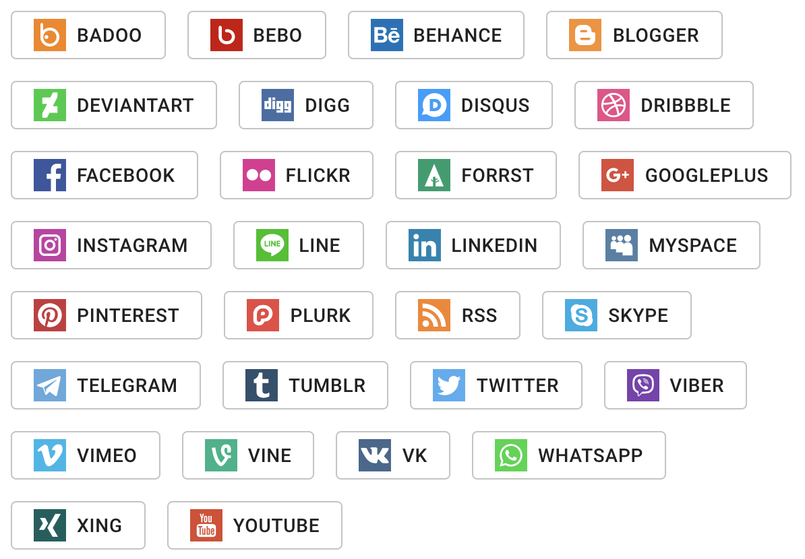

# Material UI social network icons

This is free to use set of social network flat icons wrapped in Material UI lib

## Installation

```bash
npm install @trejgun/material-ui-icons-social-networks
```

## Usage

```typescript
import React, { FC } from "react";
import {Grid, Button, makeStyles} from "@material-ui/core";

import {
  Badoo,
  Bebo,
  Behance,
  Blogger,
  Deviantart,
  Digg,
  Disqus,
  Dribbble,
  Facebook,
  Flickr,
  Forrst,
  GooglePlus,
  Instagram,
  Line,
  Linkedin,
  MySpace,
  Pinterest,
  Plurk,
  Rss,
  Skype,
  Telegram,
  Tumblr,
  Twitter,
  Viber,
  Vimeo,
  Vine,
  Vk,
  Whatsapp,
  Xing,
  Youtube,
} from "@trejgun/material-ui-icons-social-networks";


const useStyles = makeStyles(
 theme => ({
   button: {
     margin: theme.spacing(1),
   },
   icon: {
     marginRight: theme.spacing(1),
   },
 }),
 {name: "Demo"}
);


const Demo: FC = () => {
  const classes = useStyles();

  return (
    <Grid>
      <Button variant="outlined" className={classes.button}>
        <Badoo className={classes.icon} /> Badoo
      </Button>
      <Button variant="outlined" className={classes.button}>
        <Bebo className={classes.icon} /> Bebo
      </Button>
      <Button variant="outlined" className={classes.button}>
        <Behance className={classes.icon} /> Behance
      </Button>
      <Button variant="outlined" className={classes.button}>
        <Blogger className={classes.icon} /> Blogger
      </Button>
      <Button variant="outlined" className={classes.button}>
        <Deviantart className={classes.icon} /> Deviantart
      </Button>
      <Button variant="outlined" className={classes.button}>
        <Digg className={classes.icon} /> Digg
      </Button>
      <Button variant="outlined" className={classes.button}>
        <Disqus className={classes.icon} /> Disqus
      </Button>
      <Button variant="outlined" className={classes.button}>
        <Dribbble className={classes.icon} /> Dribbble
      </Button>
      <Button variant="outlined" className={classes.button}>
        <Facebook className={classes.icon} /> Facebook
      </Button>
      <Button variant="outlined" className={classes.button}>
        <Flickr className={classes.icon} /> Flickr
      </Button>
      <Button variant="outlined" className={classes.button}>
        <Forrst className={classes.icon} /> Forrst
      </Button>
      <Button variant="outlined" className={classes.button}>
        <GooglePlus className={classes.icon} /> GooglePlus
      </Button>
      <Button variant="outlined" className={classes.button}>
        <Instagram className={classes.icon} /> Instagram
      </Button>
      <Button variant="outlined" className={classes.button}>
        <Line className={classes.icon} /> Line
      </Button>
      <Button variant="outlined" className={classes.button}>
        <Linkedin className={classes.icon} /> Linkedin
      </Button>
      <Button variant="outlined" className={classes.button}>
        <MySpace className={classes.icon} /> MySpace
      </Button>
      <Button variant="outlined" className={classes.button}>
        <Pinterest className={classes.icon} /> Pinterest
      </Button>
      <Button variant="outlined" className={classes.button}>
        <Plurk className={classes.icon} /> Plurk
      </Button>
      <Button variant="outlined" className={classes.button}>
        <Rss className={classes.icon} /> Rss
      </Button>
      <Button variant="outlined" className={classes.button}>
        <Skype className={classes.icon} /> Skype
      </Button>
      <Button variant="outlined" className={classes.button}>
        <Telegram className={classes.icon} /> Telegram
      </Button>
      <Button variant="outlined" className={classes.button}>
        <Tumblr className={classes.icon} /> Tumblr
      </Button>
      <Button variant="outlined" className={classes.button}>
        <Twitter className={classes.icon} /> Twitter
      </Button>
      <Button variant="outlined" className={classes.button}>
        <Viber className={classes.icon} /> Viber
      </Button>
      <Button variant="outlined" className={classes.button}>
        <Vimeo className={classes.icon} /> Vimeo
      </Button>
      <Button variant="outlined" className={classes.button}>
        <Vine className={classes.icon} /> Vine
      </Button>
      <Button variant="outlined" className={classes.button}>
        <Vk className={classes.icon} /> Vk
      </Button>
      <Button variant="outlined" className={classes.button}>
        <Whatsapp className={classes.icon} /> Whatsapp
      </Button>
      <Button variant="outlined" className={classes.button}>
        <Xing className={classes.icon} /> Xing
      </Button>
      <Button variant="outlined" className={classes.button}>
        <Youtube className={classes.icon} /> Youtube
      </Button>
    </Grid>
  );
};
```

## How it looks like



## Image source

[FlatIcon](https://www.flaticon.com/packs/social-networks-logos-2)
